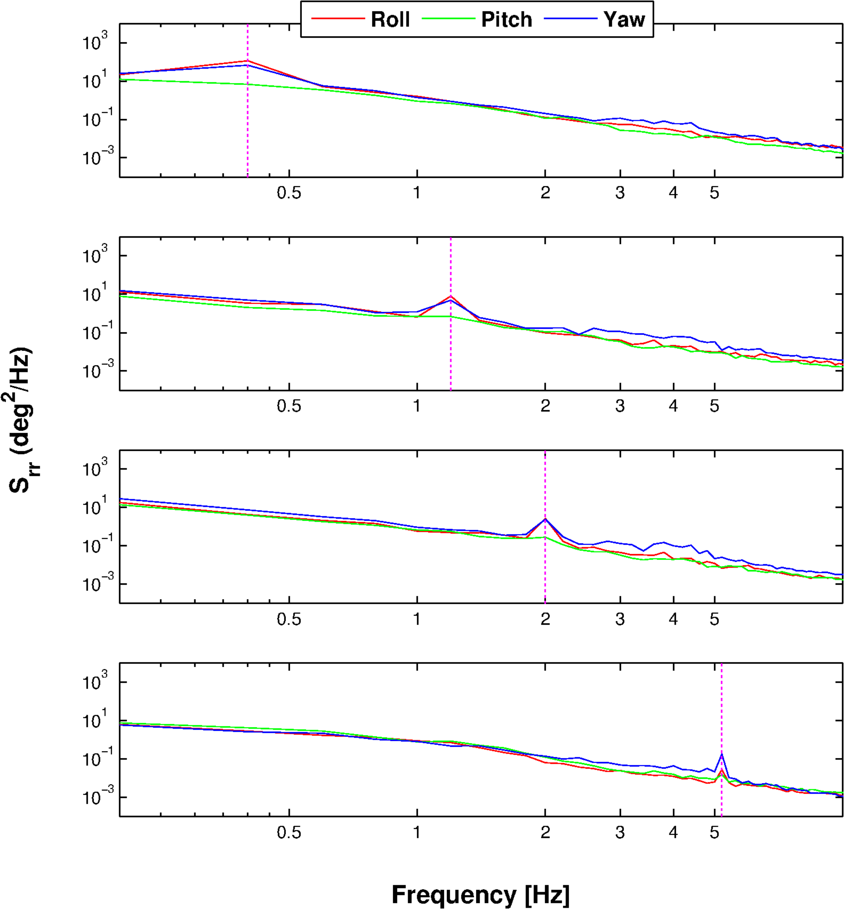
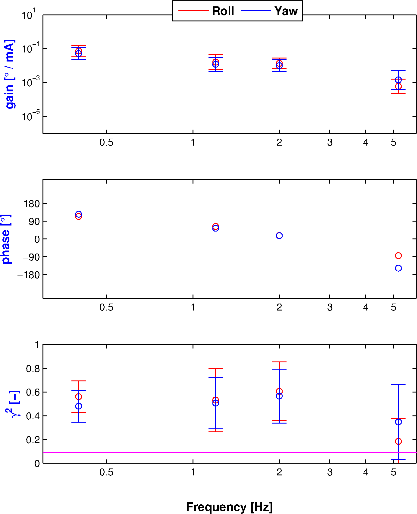
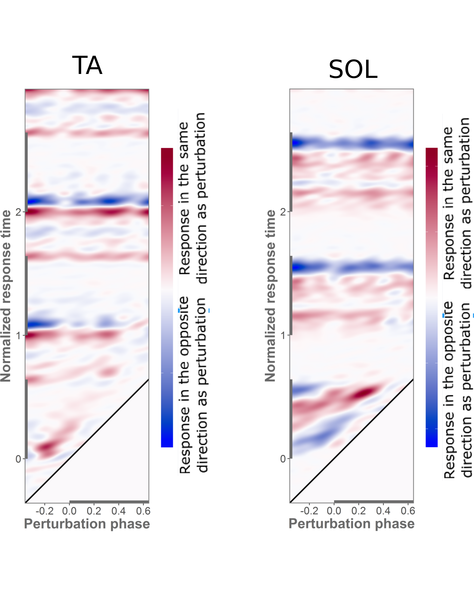
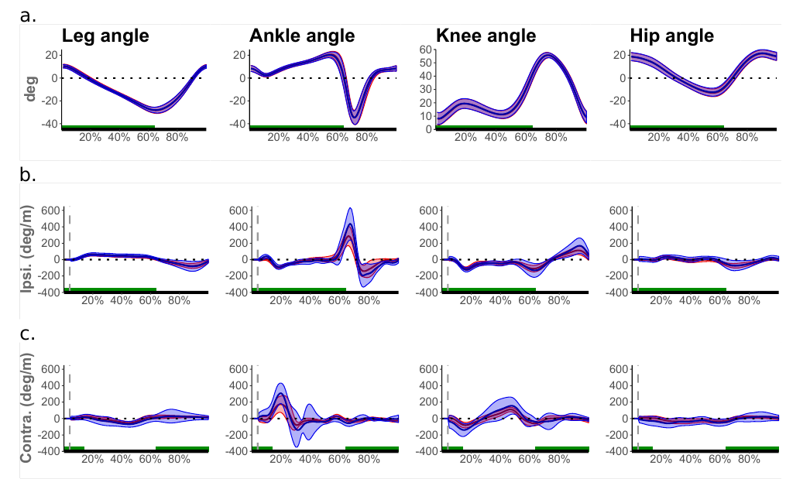
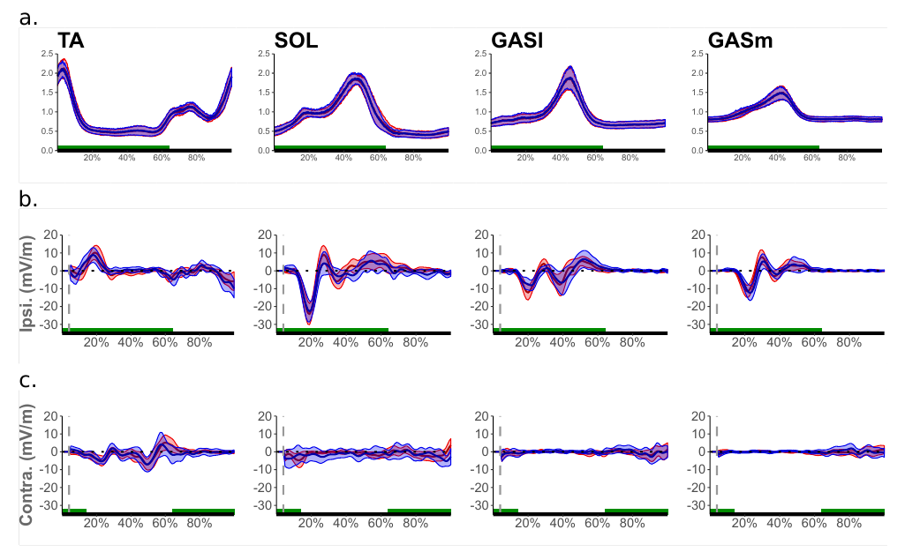

## Overview

- System Identification

- Vestibular perturbations and control of head and neck

- Visual perturbations and control of walking 

- Mechanical perturbations and control of walking

- Take-away messages

## System

- Neural control of physiological systems is complex

- Multiple inputs multiple outputs (MIMO)

- Sensory integration
    * visual
    
    * vestibular
    
    * proprioception

- Difficult or impossible to open (noninvasively)

- Lack of good models

## System Identification

- Relationship between the input and the output
    * Application of perturbations
    
    * Cause and effect relationship

- Linear time invariant (LTI)

- Frequency domain analysis

## Vestibular perturbations and control of head and neck

&nbsp;


## Galvanic vestibular stimulation (GVS)

- Cathodal / Anodal current on mastoid process (~ 1 mA)

- Perceived acceleration

- Sway in opposite direction

- Directionality of responses
    * Head coordinate system
    * Roll – Pitch - Yaw
    
```{r v2, echo=FALSE, cache=FALSE, out.width = '25%', fig.align="center"}
knitr::include_graphics('4_1.png')
```

----

&nbsp;

- Problem: What is the role of vestibular system in head stabilization?

- Goal: Could GVS provide a viable approach to investigate vestibular contribution to head stabilization?

- Hypothesis: 
    * GVS elicits consistent head and neck motion
    * Responses to GVS in seated subjects originate from vestibular afferents
    * Responses are modulated with frequency and amplitude

## Methods

- Bilateral bipolar stimulation

- Sinusoids and multisines

- 0.5 – 2 mA , 0.4 – 5.2 Hz

- 11 seated subjects

- Torso restrained – Blindfolded

- Head sway measured with motion capture (Qualisys)

## Results

- Motion with frequency of stimulus

- Amplitude modulation of response

```{r v3, echo=FALSE, cache=FALSE, out.width = '40%', fig.align="center"}
knitr::include_graphics('10_1.png')
```

## Results

- Power at stimulated frequencies

- Frequency and amplitude modulation of response

```{r v4, echo=FALSE, cache=FALSE, out.width = '50%', fig.align="center"}

```

## Results

- FRFs and coherences

- Effects of frequency

```{r v5, echo=FALSE, cache=FALSE, out.width = '40%', fig.align="center"}

```

## Results

- FRFs and coherences

- Effects of amplitude

```{r v6, echo=FALSE, cache=FALSE, out.width = '40%', fig.align="center"}
knitr::include_graphics('13_1.png')
```

## Discussion

- Small motions in the order of natural sway

- Significant coherency

- Frequency effect
    * Effect of inertia on gain and phase
        + Second order overdamped system (semicircular canals dynamics)
    * Coherence

- Amplitude effect
    * No modulation in gain and phase
    * Coherence (substantial increase)
    
## Conclusion

- GVS provides a viable approach to investigate vestibular contribution to head stabilization

- Coherent head-neck motions

- Vestibular origin of responses

- Modulation with frequency and amplitude

- Assumption of linearity
    * Effect of amplitude

## Visual perturbations and control of walking

## Gait cycle


## Control of gait

- How CNS continuously adjusts control of walking over the gait cycle to ensure stable movement

```{r c1, echo=FALSE, cache=FALSE, out.width = '75%', fig.align="center"}
knitr::include_graphics('fig_03.png')
```

- Muscle activations & speed
- Small adjustments

## Speed & muscle activity

- Direct relationship
- Peak of activity
- Steady-state walking
- Large changes in the activity


```{r c2, echo=FALSE, cache=FALSE, out.width = '40%'}
knitr::include_graphics('fig_04.png')
```
 
- Walking speed is modulated during push-off.


## Problem statement

- How do small changes in muscle activations compare between steady-state conditions and transient responses?

&nbsp;

- How does the role of muscles in control of speed compare between steady-state walking and walking under perturbations?

## Definitions

- Difference in mean waveforms (MW)
- Transient waveform (TW)

```{r c4, echo=FALSE, cache=FALSE, out.width = '100%'}
knitr::include_graphics('fig_05.png')
```

## Transient responses

- Changes due to perturbations that lead to transient changes in speed

&nbsp;

- How can we calculate transient responses to perturbations?

## LTP systems and HTFs

&nbsp;

```{r c5, echo=FALSE, cache=FALSE, out.width = '30%'}
knitr::include_graphics('gif_1.gif')
```
```{r c6, echo=FALSE, cache=FALSE, out.width = '26%'}
knitr::include_graphics('fig_06.png')
```
```{r c7, echo=FALSE, cache=FALSE, out.width = '30%'}
knitr::include_graphics('gif_2.gif')
```

- For walking frequency  $f_0$ , the $k-th$ mode of HTF describes how input at frequency  $f$  is mapped to output at frequency $f +kf_0$

- Each mode of the HTF is described by its own gain and phase functions.


## Phase-dependent IRF (φIRF)
```{r c8, echo=FALSE, cache=TRUE, message=FALSE, warning=FALSE}

require(colorRamps)
require(colorspace)
require(plotly)

setwd("/home/feri/Documents/0PhD/Data/VSP_m")

airt <- vector("list", 4)

airt[[1]] <- read.csv("airf1_t.csv", header = FALSE)
airt[[2]] <- read.csv("airf2_t.csv", header = FALSE)  # averaged IRFs for all phases of stimulus (not just one slice)
airt[[3]] <- read.csv("airf3_t.csv", header = FALSE) 
airt[[4]] <- read.csv("airf4_t.csv", header = FALSE)

mdf <- read.csv("mdf.csv", header = FALSE, stringsAsFactors = FALSE)
toff <- trunc(mean(mdf[,1])*10^3)/10^3 

cont <- lapply(airt, as.matrix)
qmin <- -0.5 + toff -0.5
qmax <- 1
q1 <- as.data.frame(seq(qmin, toff, length.out = dim(cont[[2]])[1]))
q2p <- as.data.frame(seq(qmin, qmax, length.out = dim(cont[[2]])[2]))

qq1 <- as.numeric(unlist(q1))
qq2p <- as.numeric(unlist(q2p))

IRF <- as.matrix(airt[[2]])

plot_ly(x = rev(qq2p), y = qq1, z = IRF, type = "surface", opacity = 1, colors = diverge_hcl(121, c = 120, l = c(20,90), power = 1.0)) %>%
  layout(scene = list(
      xaxis = list(title = "Normalized response time"),
      yaxis = list(title = "Perturbation phase"),
      zaxis = list(title = "IRF")
    ))

```

##

```{r c9, echo=FALSE, cache=FALSE, out.width = '50%'}

```

##

```{r c10, echo=FALSE, cache=FALSE, out.width = '55%'}
knitr::include_graphics('img2.png')
```

## Methods

- Visual perturbations (filtered white noise) in virtual reality cave

- 21 subjects walked at 1.25 & 1.38 m/s (2.8 & 3.1 miles/h) (~10% increase)

- Input was velocity of visual scene and outputs were EMG and kinematics


## Results

```{r c11, echo=FALSE, cache=FALSE, out.width = '45%'}
knitr::include_graphics('fig3_07.png')
```

##

```{r c12, echo=FALSE, cache=FALSE, out.width = '90%'}
knitr::include_graphics('image202.png')
```


## Discussion

- Similarities between MW changes and TW

- Functional roles of different muscles

- Cause and effect relationship

- Differences for plantarflexors

    * Contribution to control of speed in two different intervals

## Limitation & future work

- Limitations of surface EMG

- Not all muscles were measured

- Assumption of left-right symmetry

- Assumption of linearity


## Mechanical perturbations and control of walking

- How do small changes in treadmill speed affect kinematic responses and modulations of muscle activations?

```{r c20, echo=FALSE, cache=FALSE, out.width = '75%'}
knitr::include_graphics('fig_03.png')
```

## Methods

- Perturbations of treadmill belt (filtered white noise)

- Average speed: 1.3 m/s

- 15 subjects

- 2 perturbation amplitudes

- EMG from 14 muscles


## Results

Single-support kinematics

```{r c21, echo=FALSE, cache=FALSE, out.width = '85%'}
knitr::include_graphics('fig5_1.png')
```

## single-support EMG

```{r c22, echo=FALSE, cache=FALSE, out.width = '90%'}
knitr::include_graphics('fig5_2.png')
```

## double-support kinematics

```{r c23, echo=FALSE, cache=FALSE, out.width = '90%'}

```

## double-support EMG

```{r c24, echo=FALSE, cache=FALSE, out.width = '90%'}

```

## Discussion

&nbsp;

- Both kinematic and EMG responses

- Single-support and double-support responses

- Responses in all leg muscles for both amplitudes

- Assumption of linearity

## Take-away messages

&nbsp;

- Neural control of physiological systems is complex

- System identification
    * Nonparametric
    
    * Noninvasive
    
    * Cause and effect
    
    * Responses to small perturbations

## Questions


